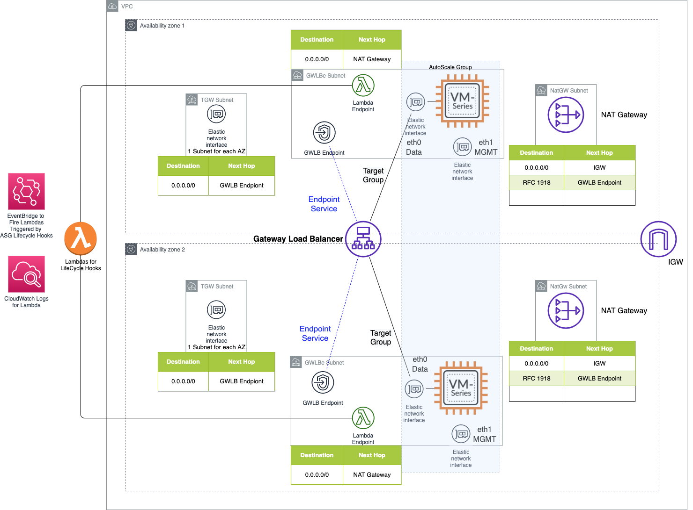

# GWLB + Warm Pool AutoScaling with VM-Series

This repository contains a CloudFormation Template and supporting Lambda Functions to deploy the following.

- 1 VPC
- 1 IGW
- 2 NAT gateways
- 6 subnets, 3 in each Availability Zone (AZ)
- 6 route tables, 3 in each AZ
- 2 Security groups
- ASG of VM-Series Firewalls with support warm pools, scaling policy and metrics
    - [Warm Pools](https://docs.aws.amazon.com/autoscaling/ec2/userguide/ec2-auto-scaling-warm-pools.html)
- 3 Lambda Functions for Lifecylce hooks
- 1 Lambda Function to to update ASG isntance specs after permissions complete
- 3 EventBridge Rules to trigger the lambdas
- 1 Amazon Linux 2 acting as bastion host
- 1 GWLB
- 1 Target group for GWLB 
- 1 Listner for GWLB
- 1 VPC endpoint service
- 2 GWLB endpoints, 1 in each AZ

Certain Assumption and changes have been made from previous iterations of the Palo Alto Networks autoscaling.

- Utilize EventBridge instead of timers
- Use ASGs with 2 interfaces per instance rather than all of the added eni python scripting
- Cloudwatch will retries a lamnda twice after timeouts.  Implemented the necessary timing rather than selfcalling lambdas.
- 4 Lambdas
    - Warm Pool Build
        - Check when firewall up before releasing <h3>NOTE this is the critical piece when using Warm Pools.  Other wise the ASG will stop the firewall during the bootstrap process.</h3>
        - Requires Panorama Push
    - Full service Launch
        - Check when firewall up before releasing
        - Requires Panorama Push
    - Terminate
        - Remove from Panorama
        - Dereg if BYOL
    - Update ASG capacities once lifecycle automation is built
        - Must be done after the lifecycle automation is complete otherwise the firewalls start before the lambdas are built.
- Supports Multiple Zones

## Requirements
- Requires [Bootstrapping init-cfg](https://docs.paloaltonetworks.com/vm-series/9-0/vm-series-deployment/bootstrap-the-vm-series-firewall/create-the-init-cfgtxt-file.html) rather than user data to retrieve the Device Group and Template Stack name
- Lambda Endpoint with connectivity to firewalls and Panorama via a NatGw
- Mgmt profile with HTTPs on eth1/1
    - AWS doesn’t always map interface numbers correctly
- If using the Panormaa Licensing Plug-in and Warm Pools, do not let it dereg the stopped firewalls
- Firewall, Panorama and CSP (BYOL) API Keys
    - [Firewall and Panorama](https://docs.paloaltonetworks.com/pan-os/10-0/pan-os-panorama-api/get-started-with-the-pan-os-xml-api/get-your-api-key.html)
    - [CSP](https://docs.paloaltonetworks.com/vm-series/10-0/vm-series-deployment/license-the-vm-series-firewall/licensing-api/manage-the-licensing-api-key.html)
- If you unpack the zip file to make changes, ensure to repackage the zip with at least botocore v1.17.48 as it is not included in the current lambda python 3.8 iteration.      

## Deployment
1. Create an S3 bucket to [bootstrap the firewall](https://docs.paloaltonetworks.com/vm-series/10-0/vm-series-deployment/bootstrap-the-vm-series-firewall/bootstrap-the-vm-series-firewall-in-aws.html) with the init-cfg.txt and any other necessary configuration items. 
2. Add the asglambdas.zip file to the root of the bootstrap. 
3. Deploy the cloudformation template.
4. Attach to TGW if necessary.
    - Update the GWLBe Subnet Route tables to send proper spoke routes to the TGW.
5. Create [GWLB endpoints](https://docs.paloaltonetworks.com/vm-series/10-0/vm-series-deployment/set-up-the-vm-series-firewall-on-aws/vm-series-integration-with-gateway-load-balancer/integrate-the-vm-series-with-an-aws-gateway-load-balancer/associate-a-vpc-endpoint-with-a-vm-series-interface.html) in other VPCs for inbound routing.
    - Routing examples can be found in the [Reference Architecture](https://www.paloaltonetworks.com/resources/reference-architectures/aws).

## To-Do List
- [x] ~~Add RFC 1918 Routes to the NatGW RTB~~
- [x] ~~Clean-up unused declaration blocks in the yaml.~~
- [x] ~~Diagram~~
- [x] ~~Remove Service Name Lambda~~
- [ ] Cleanup the logging in in the python files, I am currently logging almost everything.
- [ ] Look for areas to improve error handling in the python.
- [ ] Support User Data bootstrapping of the DG and TS. (Deciding whether or not to just ask for the DG and TS in the template)
- [ ] More Testing without Panorama. (Considered lower priority due to most customers using ASG are also using Panorama)

